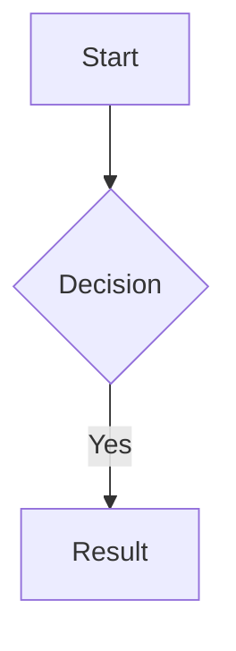

# Obsidian Flavored Markdown

Obsidian extends CommonMark and GFM with wikilinks, embeds, callouts, properties, and comments. Standard Markdown (headings, bold, italic, lists, tables, code blocks) is assumed knowledge.

## Workflow: Creating an Obsidian Note

1. Add frontmatter properties at the top (see [PROPERTIES.md](references/PROPERTIES.md))
2. Write content using standard Markdown plus Obsidian-specific syntax below
3. Link related notes with `[[wikilinks]]` for vault-internal links; use `[text](url)` for external URLs
4. Embed content with `![[embed]]` syntax (see [EMBEDS.md](references/EMBEDS.md))
5. Add callouts using `> [!type]` syntax (see [CALLOUTS.md](references/CALLOUTS.md))

## Internal Links (Wikilinks)

```markdown
[[Note Name]]                          Link to note
[[Note Name|Display Text]]             Custom display text
[[Note Name#Heading]]                  Link to heading
[[Note Name#^block-id]]                Link to block
[[#Heading in same note]]              Same-note heading link
```

Define block IDs by appending `^my-block-id` after a paragraph, or on a separate line after lists/quotes.

## Embeds

```markdown
![[Note Name]]                         Embed full note
![[Note Name#Heading]]                 Embed section
![[image.png]]                         Embed image
![[image.png|300]]                     Embed image with width
![[document.pdf#page=3]]               Embed PDF page
```

See [EMBEDS.md](references/EMBEDS.md) for audio, video, and search embeds.

## Callouts

```markdown
> [!note]
> Basic callout.

> [!warning] Custom Title
> Callout with a custom title.

> [!faq]- Collapsed by default
> Foldable callout (- collapsed, + expanded).
```

Common types: `note`, `tip`, `warning`, `info`, `example`, `quote`, `bug`, `danger`, `success`, `failure`, `question`, `abstract`, `todo`. See [CALLOUTS.md](references/CALLOUTS.md) for full list.

## Properties (Frontmatter)

```yaml
---
title: My Note
date: 2024-01-15
tags:
  - project
  - active
aliases:
  - Alternative Name
cssclasses:
  - custom-class
---
```

Default properties: `tags` (searchable labels), `aliases` (link suggestions), `cssclasses` (CSS classes). See [PROPERTIES.md](references/PROPERTIES.md) for all types.

## Tags

```markdown
#tag                    Inline tag
#nested/tag             Nested tag with hierarchy
```

Tags can contain letters, numbers (not first), underscores, hyphens, forward slashes.

## Comments

```markdown
This is visible %%but this is hidden%% text.
%%
This entire block is hidden.
%%
```

## Obsidian-Specific Formatting

```markdown
==Highlighted text==
```

## Math (LaTeX)

```markdown
Inline: $e^{i\pi} + 1 = 0$

Block:
$$
\frac{a}{b} = c
$$
```

## Diagrams (Mermaid)

````markdown

````

## Footnotes

```markdown
Text with footnote[^1].
[^1]: Footnote content.
Inline footnote.^[This is inline.]
```
